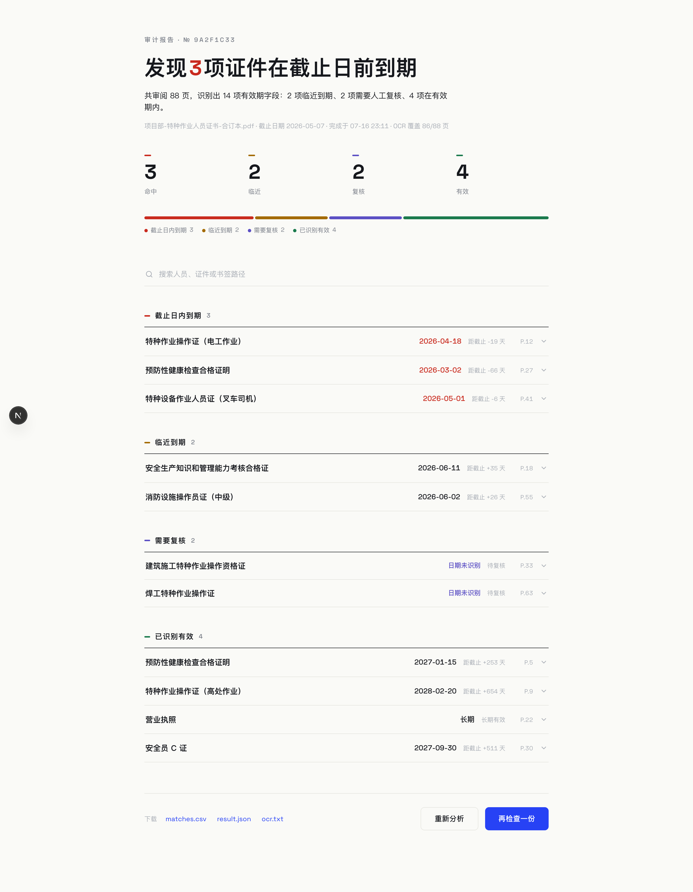
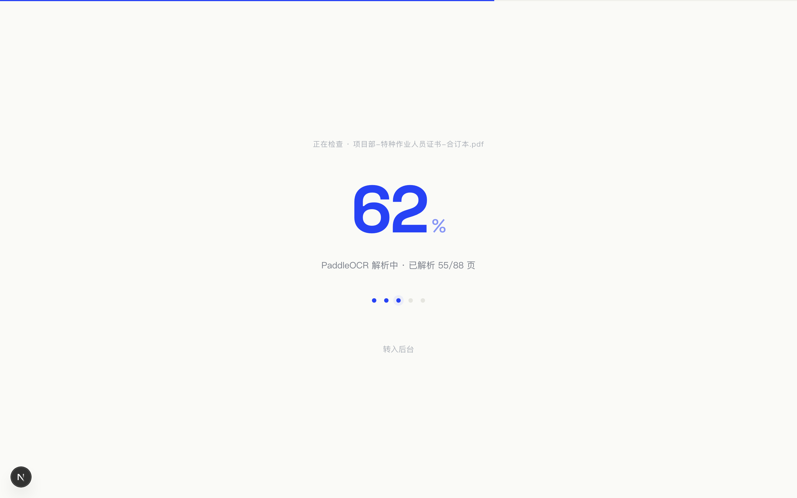

<div align="center">
  <h1>Beacon</h1>
  <p><em>在证件过期之前，点亮它。</em></p>

  <p>
    <a href="https://github.com/can4hou6joeng4/Beacon/stargazers"></a>
    <a href="LICENSE"></a>
    <a href="https://github.com/can4hou6joeng4/Beacon/commits"></a>
    
    
  </p>
</div>

<p align="center">
  
</p>

## 为什么叫 Beacon

灯塔的意义不在于照亮，而在于**提前预警**——在船触礁之前，让危险被看见。Beacon 做的是同一件事：在证件过期造成损失之前，把它找出来。

上传一份含书签的人员证件汇编 PDF（特种作业证、健康证明、资格证书……），Beacon 会自动 OCR 识别每一页、提取有效期字段，并按你设定的截止日期把所有证件分成四类：**截止日内到期 / 临近到期 / 需要复核 / 有效**，最后生成一份可搜索、可展开证据、可下载的审计报告。

与 [Harbor](https://github.com/can4hou6joeng4/Harbor)（知识停泊的港湾）同属一个家族：Harbor 收藏知识，Beacon 预警风险。

## 功能特性

- 📄 **一份 PDF 进，一份报告出**：拖入证件汇编 PDF、设定截止日期，三步开始检查
- 🔍 **云端 OCR**：PaddleOCR-VL 异步逐页识别，实时进度反馈（巨幅百分比 + 五阶段步进）
- 🗂 **四分类审计**：截止日内到期（含当天）/ 45 天内临近到期 / 无法解析需人工复核 / 有效；「长期」证件永不过期
- 🧾 **证据可追溯**：每条结果附带 OCR 字段片段与上下文原文，展开即查，支持全文搜索
- 🛡 **容错识别**：针对 OCR 常见错字（如「史用效期」「有贿限」）的鲁棒正则规则库，规则更新后旧任务可一键重新分析（不重复计费）
- 📥 **产物下载**：`matches.csv` / `result.json` / `ocr.txt` 随报告提供
- 👥 **多用户与配额**：管理员管理成员，上传流量 / OCR 任务数 / OCR 页数按日配额
- ☁️ **无服务器架构**：整站运行在 Cloudflare Workers 上，D1 存历史、R2 存产物，零运维

## 工作原理

```
浏览器 ──① 创建任务──▶ Worker API ──② PDF 直传──▶ R2
   │                                              │
   └──③ 轮询进度（轮询即引擎）──▶ PaddleOCR 异步解析 ◀─┘
                    │
                    ▼
        ④ 有效期抽取 → 四分类 → 报告与产物写入 R2 / D1
```

管线由客户端轮询驱动，没有后台队列与常驻进程——状态轮询本身就是推进器，天然契合 Workers 的无状态模型。

<p align="center">
  
</p>

## 技术栈

- **前端**：Next.js 16 App Router + React 19 + Tailwind CSS 4（CSS-first，单一浅色纸感主题）
- **部署**：OpenNext → Cloudflare Workers，自定义域名
- **存储**：Cloudflare D1（任务历史 / 用户 / 配额账本），R2（PDF 与审计产物）
- **OCR**：PaddleOCR-VL 云端 API（异步任务制）
- **认证**：自研 Cookie 会话（PBKDF2 + WebCrypto），无第三方认证依赖

## 本地开发

```bash
cd web
npm install
npx wrangler d1 migrations apply pdf-audit-db --local   # 初始化本地 D1
AUDIT_OBJECT_STORE_DRIVER=r2-binding AUTH_BOOTSTRAP_TOKEN=<自定义> npm run dev
```

```bash
npm test           # vitest 单元测试（分析器规则、配额、上传会话等）
npm run lint       # ESLint 9
npm run build      # next build 快速校验
npm run cf:build   # Workers 兼容性门禁（必过）
```

> 首个管理员通过 `POST /api/auth/bootstrap`（携带 `AUTH_BOOTSTRAP_TOKEN`）创建；本地 Miniflare R2 不支持流式上传，完整管线需在部署环境验证。

## 部署

```bash
cd web
env -u CLOUDFLARE_API_TOKEN npm run cf:deploy            # 浏览器 OAuth 部署
npx wrangler d1 migrations apply pdf-audit-db --remote   # 迁移需手动应用
npx wrangler secret put PADDLEOCR_API_TOKEN              # 及其他密钥
```

## License

[MIT](LICENSE) © [can4hou6joeng4](https://github.com/can4hou6joeng4)
